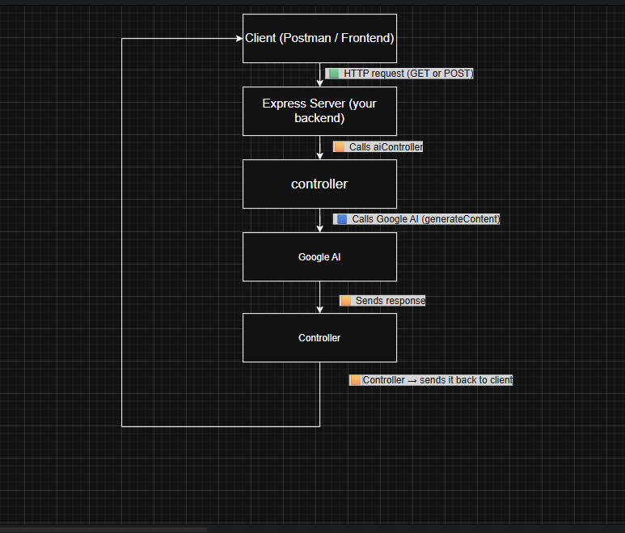
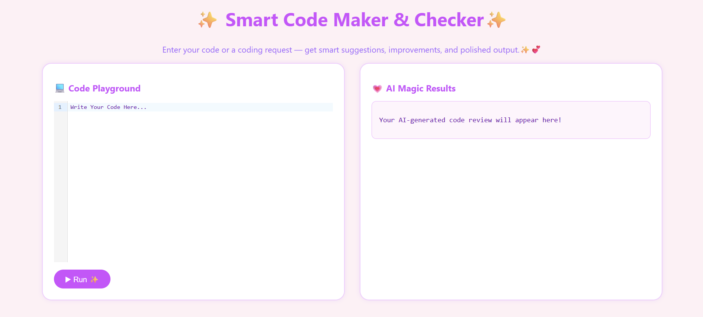
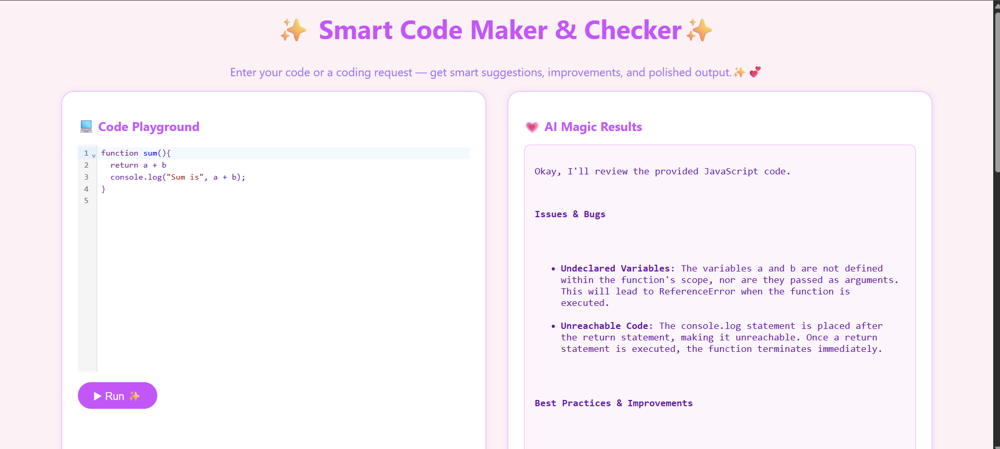
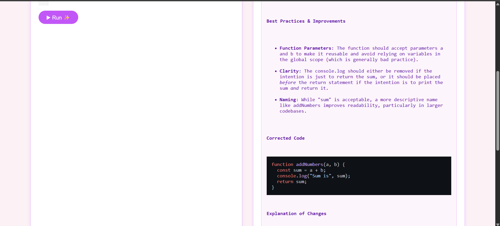

# Code Maker & Checker

This is a full-stack web application that empowers developers to:

📩 Write a prompt or request, and the AI will generate code for you
✍️ Write code or submit code review requests
🤖 Receive AI-generated code reviews with detailed feedback
🚀 Get improvement suggestions for better performance, readability, and security
🎨 Enjoy a beautiful, intuitive user interface designed for productivity

## ✨ Features

- 💻 Write JavaScript code in a sleek editor (CodeMirror)
- 🤖 Get instant feedback and reviews from **Google Gemini Flash 2.0**
- 📊 View bugs, improvements, and corrected code with explanation
- 🌈 Markdown output with syntax highlighting
- 🔄 Fast communication with a Node.js + Express backend

## 💡 Tech Stack

- **Frontend**: React, Vite, CodeMirror, React Markdown, Rehype Highlight
- **Backend**: Node.js, Express, Axios
- **AI Model**: Google Gemini Flash 2.0 (via Gemini API)

## 🖼️ Screenshots

### App Flow


### Homepage Views




## 🚀 Getting Started

```bash
# Frontend
cd frontend
npm install
npm run dev

# Backend
cd ../backend
npm install
npm start
